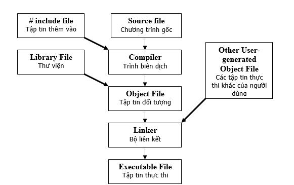
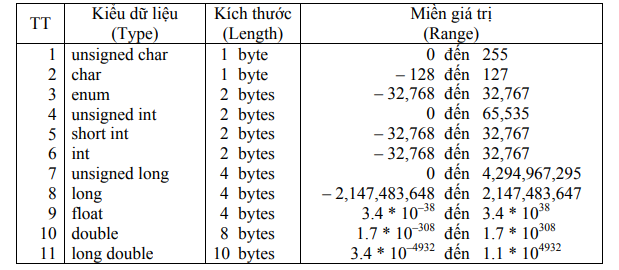
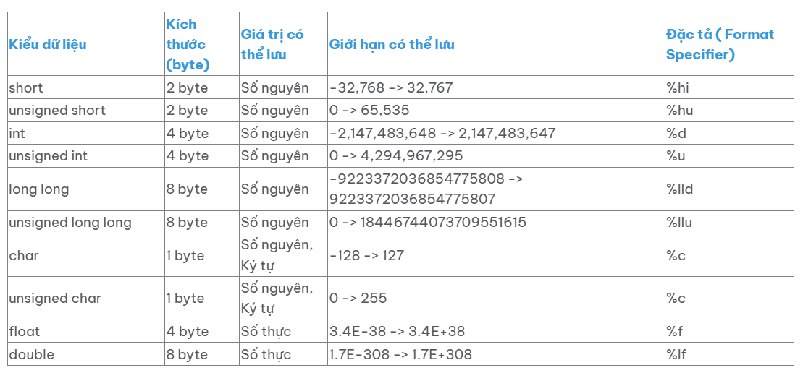
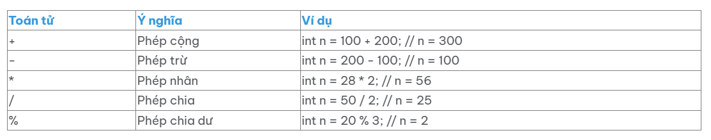
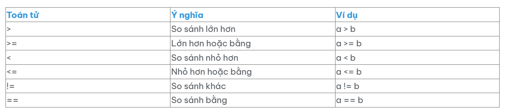
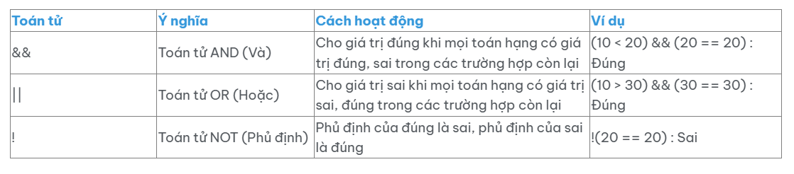
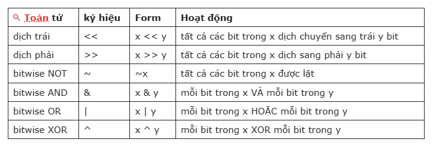
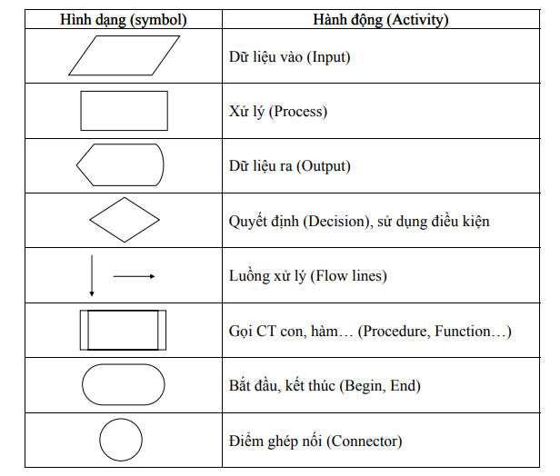

# Introduction Basic C Programming Language

## The C language is a Fundametal Language

- The C language is considered "The mother language" of modern programming languages.When you learn C++,Java, PHP, C# or Javascript, you'll find that learning programming through C helps you quickly grapsp these other programming language.This is because the syntax and concepts of C are very similar to those of these popular programming languages.While you don't necessarily have to start with the C programming language, from my experience, beginning your programming journey with C or C++ is still the optional choice. 
  

  

## 1. Basic Data Types 

### + Primitive Data Types (Cac kieu du lieu co ban) :
- int: (So nguyen).
- float: (So thuc).
- double: (So thuc do chinh xac cao).
- char: (ky tu).
  

  

### + Derived Data Types:
- array: (Mang).
- pointer: (con tro).
- structure: (Cau truc).
- union: (Lop).
- enum: (Liet ke).

## 2. Data Modifiers (Cac bien doi du lieu)

  

  
## 3. Operators (Toan tu)

### + Arithmetic Operators (Toan tu so hoc) : 

  

### + Relational Operators (Toan tu so sanh) :

  

  
### + Logic Operators (Toan tu logic) :

  

### + Increment and Decrement Operators (Toan tu tang giam) :

To increase the value of a variable  by 1, you can the ++ operator, or to decrease the value by 1, use can the -- operator.
- ++a: increase first (Tang truoc).
- a++: increase after (tang sau).
- --a: decrease first (giam truoc).
- a--: decrease after (giam sau).

### + Bitwise Operators (Toan tu bit) :

Bitwise operators  are a set of operators and funcions speciffically designed to perform transfomation and calculation operation on the bits of an integer (such as int or long long C++).

  

### + Conditional Operators (Toan tu ba ngoi) :

- Syntax: [Comparation Expression] ? [Return value 1] ? [Return value 2] .

- Meaning: The first part of this operator will evaluate to either true or false.If part evaluate to true, the expression  will return value 1, otherwise, if  this part evaluates to false, the expression will return value 2.

Example: int n = 10 < 20 ? 100 : 200; 
- In this case, n will have the value of 100, because 10 < 20 evaluates to true, so n assigned the value of 100 instead of 200.

## 4. Control Structures (Cau truc dieu khien)

### + Conditional Statements (Dieu kien) :
- if, else, else if, switch, case, default.

### + Loop (Vong lap) :

- for, while, do-while.
  
### + Jump Statements (Cau lenh nhay) :

- break: (Thoat vong lap)
- continue: (bo qua vong hien tai) 
- return: (tra ve)
- goto: (nhay den nhan chi dinh)

## 5. Functions (Ham)

### + Fuction Types:

- Void Function (does not return a value).
- Function that returns value (int, float, etc..).
- Function with parameters and without parameters.
  
### + Function Declaration (Khai bao ham) :

### + Function Definition (Dinh nghia ham) :

### + Function Call (Goi ham) :
### + Recursion (De quy):

## 6. Basic Standard Libraries (Thu vien chuan co ban)

- stdio.h: (I/O: printf, scanf).
- stdlib.h: (ham chung: malloc, free, exit).
- string.h: (chuoi: strlen, strcpy, strcat).
- math.h: (Toan hoc: sqrt, pow, sin, cos,...).
- ctype.h: (kiem tra ky tu isalpha, isdigit).
- time.h: (Thao tac voi thoi gian: time, localtime, strftime,... ).
- assert.h: (Kiem tra dieu khien in ra loi: assert).
- errno.h: (cung cap bien error luu tru ma loi, xu ly loi).

## 7. Pointers and Memory Management (Con tro va Quan ly bo nho)

- malloc: (dynamic memory allocation).
- calloc: (dynamic memory allocation and initialization).
- realloc: (resize allocated memory).
- free: (release memory).
- Null Pointer: null.
- Dangling Pointer: (invalid pointer).
  
## 8. String  (Chuoi)
####  In C, to store a string of characters, you use a char array.There are vairous terms used to refer to a character array:character string, character array, or string.

#### I often refer to it as a character string char str[] ="example"

#### Here are the string manipulation funcions from string.h

- strlen: (do dai chuoi)
- strcpy: (sao chep chuoi)
- strcat: (noi chuoi)
- strcmp: (so sanh chuoi)

## 9. File Handling (Tep)

### + Open and Close Files: fopen, fclose.

### + Read and Write Files: fscanf, fgets, fputs.

### + File Modes:

- "r": read (file must exist) 
- "w": write (create or truncates file)
- "a": read (writes to end, create if not exists)
- "rb":read (file must exist)
- "wb" :Write binary (creates or truncates file)
- "ab": Append binary (writes to end, creates if not exists)
- "r+": Read and write (file must exist)  
- "w+": Read and write (creates or truncates file)
- "a+": Read and append (reads from start, writes to end)
- "rb+": Read and write binary (file must exist)
- "wb+": Read and write binary (creates or truncates file)
- "ab+": Read and append binary (reads from start, writes to end)

## 10. Error Handling (Xu ly loi)
- Function perror: (in ra loi)
- errno: (bien luu ma loi)
  
## 11. Advanced Techniques (Ky thuat nang cao)

### + Dynamic Memory Allocation
#### malloc

- Allocates specified bytes of memory.
  
- Syntax: void* malloc(size_t size);
  
#### free

- Deallocates previously allocated memory.
- Syntax: void free(void* ptr);
#### calloc

- Allocates memory for an array and initializes all bytes to zero.
- Syntax: void* calloc(size_t num, size_t size);

### + Macros
- define PI 3.14 (định nghĩa hằng số)
- define SQUARE(x) (x * x) (định nghĩa macro hàm)

### + Preprocessor Directives (Chi thi tien xu ly)
- #include, #define, #ifdef, #ifndef, #endif, #pragma

## 12. System Calls (Thao tac tren he thong)
### + Exit code
- exit(0): thoat chuong trinh
- exit(1): thoat chuong trinh loi
### + System Commands
- Use system ("command") de chay chuong trinh

## 13. Flowchart

  

# Conclusion

### The content above is designed to provide you with an overview of the C programming language, covering the most fundamental concepts and examples. However, it is inevitable that some aspects may not have been included or explained in depth.

### To excel in C programming, you should explore additional reliable resources such as specialized books, online courses, technology forums, and official documentation. Most importantly, you need to dedicate time to regular practice through exercises and projects to solidify your skills.
